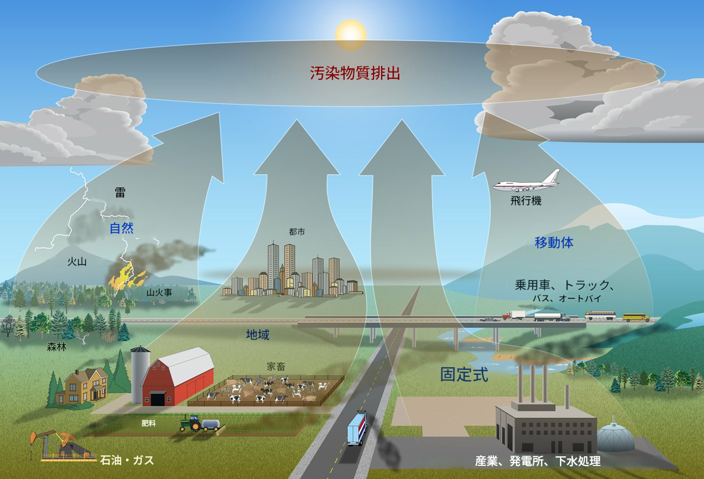

# エージェンティックワークフロー設計：ハンズオンワークショップ

Cloudera AI Studio は、エンタープライズ内の生成 AI ソリューションの開発とデプロイを効率化するために設計されたロー・コードツールのスイートです。

このハンズオンワークショップ「エージェンティックワークフロー設計」は、**Cloudera AI Agent Studio** を使用してエンドツーエンドのエージェンティックワークフローを設計・構築する方法を参加者に教えることに焦点を当てています。実世界のユースケースにエージェンティックワークフロー設計を適用し、参加者が効率的でインテリジェントなソリューションを容易に作成できるようになることを目指しています。

## ユースケースと目的

このワークショップでの目的は、この課題に対処し、正確な大気質解析を提供する大気質調査システムを構築することです。

## モジュール

- **ワークショップの範囲**

    ***

    **目的**

    - [ ] ハンズオンワークショップの範囲とセッション詳細

    ***

    [ワークショップ範囲を表示](modules/README.md)

- **AI エージェント基礎**

    ***

    **目的**

    - [ ] エージェンティックワークフロー概観

    ***

    [プレゼンテーション](https://docs.google.com/presentation/d/1jSKkVN6xjV9blB_2pUYuZwnD1yhOVE9lzcAr-yVV8vE/edit)

- **AI エージェントのハンドコーディング**

    ***

    **目的**

    - [ ] ハンドコーディングされたエージェンティックワークフローに必要なコンポーネントのセットアップ
    - [ ] マルチエージェンティックワークフローの構成要素を設計する
    - [ ] エージェンティックワークフローでカスタムツールを構築する

    ***

    [モジュールコンテンツへ](modules/module1/README.md)

- **Agent Studio でのマルチエージェントワークフロー設計**

    ***

    **目的**

    - [ ] Cloudera AI Agent Studio を使用してマルチエージェンティックワークフローを構築する

    ***

    [モジュールコンテンツへ](modules/module2/README.md)

## リソース

| 項目        |                           |
| ----------- | ------------------------------------ |
| **ユースケースソースコード** | [GitHub リポジトリへのリンク](https://github.com/SuperEllipse/AirAware/tree/Lab)  |
| **デモ録画**       | <作成予定> |
| **デモビデオ録画**   | <近日公開予定> |
| **フィードバック / コメント**    | Vish Rajagopalan|
