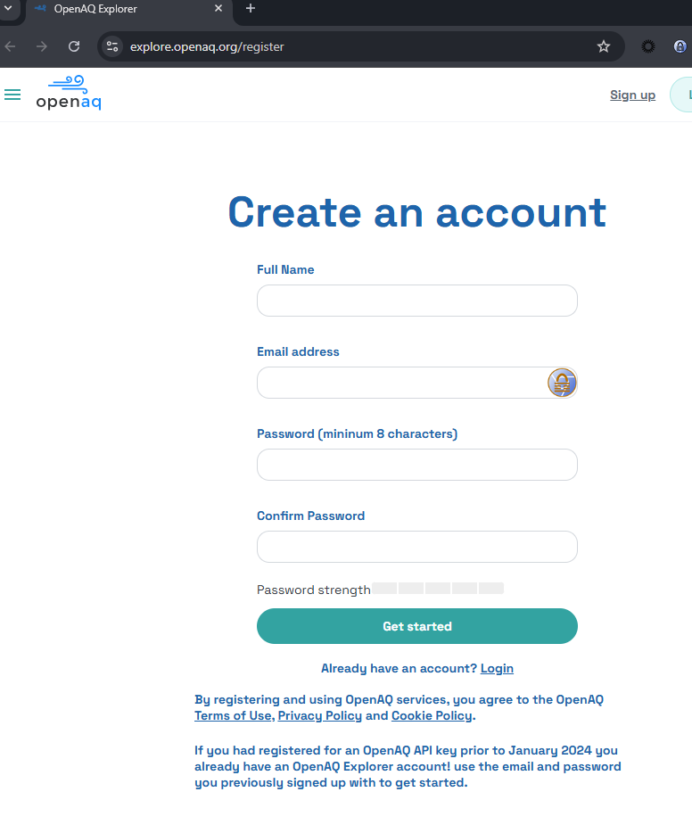
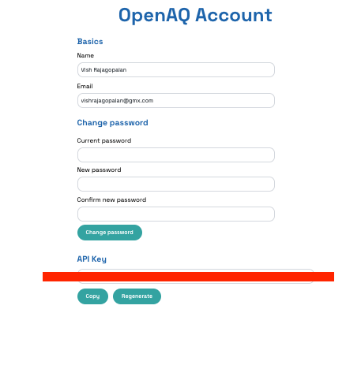

 # ラボ 1：ワークショップ環境の設定

## ワークショップの設定 :

| Cloudera テナント名 | ワークスペース名 | プロジェクト名 |
|---------------------|------------------|----------------|
| se-xxx（講師が提供） | aistudio-hol-ml | Airaware-Team-XX |

具体的なチーム名はインストラクタから提供されます。

## 目的

この演習では以下を学びます：

- [ ] ハンドコーディングされたエージェントワークフローに必要なコンポーネントのセットアップ
- [ ] Open Airquality データセット（OPENAQ）を扱うためのキーの作成

## ラボ手順
!!!danger "重要"
    下記の手順を実行する前に、ラボインストラクタに確認してください。プロジェクトが自動デプロイで既にセットアップ済みの場合があります。その場合は、以下の**Test Your Project** セクションに進んでください。

### CAI プロジェクトのセットアップ
- CAI で新しいプロジェクトを作成します。
- プロジェクトのタイプは **Git** とし、以下の設定を使用します：
    - Git URL: `https://github.com/SuperEllipse/AirAware.git`
    - Branch: `Lab`
    
    !!!important
        上記リポジトリの**`Lab`** ブランチをクローンしていること、**Main ブランチではない**ことを確認してください。

- プロジェクト設定に移動し、`Advanced` タブをクリックして `OPENAI_API_KEY` という名前の環境変数を作成します。値欄にあなたの OpenAI キーを入力してください。

    !!!Note
        インストラクタがプロジェクトを事前にセットアップしている場合、`OPENAI_API_KEY` をプロジェクト設定に追加する必要はないかもしれません。いずれにせよインストラクタに確認してください。

- 新しいターミナルを開き、以下の操作を行います。

- `requirements.txt` を開き、Pydantic や CrewAI のような、エージェントワークフローに必要な主要パッケージを確認します。

- システムにパッケージをセットアップするために以下のコマンドを実行します：

```bash
pip install -r requirements.txt
```

### プロジェクトのテスト
- インストラクタから割り当てられたプロジェクトと「ペアプログラミング」パートナーがいるはずです。（不明な場合は先にインストラクタに確認してください）
- 割り当てられたプロジェクトにログインできることを確認します。
- デフォルトの Cloudera AI セッションを設定して起動します（構成：2 vCPU、4 GB メモリ、Python 3.11、PBJ ランタイム）。セッションが正常に起動するか確認してください。
- セッションからターミナルを起動できることを確認します。

## API アクセスのセットアップ

- Open Air Quality のウェブサイトでアカウントを作成します： [https://explore.openaq.org/register](https://explore.openaq.org/register)



**ヒント:**<br>
    強力なパスワードの例：AI.agents.rocks.XX（あなたのチーム番号）

- OpenAQ にログインし、アカウント設定から API キーを生成します。



- この API キーをコピーしてメモ帳などに安全に保存してください。後で必要になります。

## 学習メモ

- [x] CAI プロジェクトをセットアップし（未設定の場合）、テストを行いました。

- [x] 外部の大気質データにアクセスするために OPENAQ のアカウントを作成し、API キーを生成してプロジェクトに登録しました。

これでラボ1 を終了します。

[ラボ2へ進む](https://github.com/cloudera-jp/agent-studio-lab-ja/blob/main/content/modules/module1/lab2.md)
