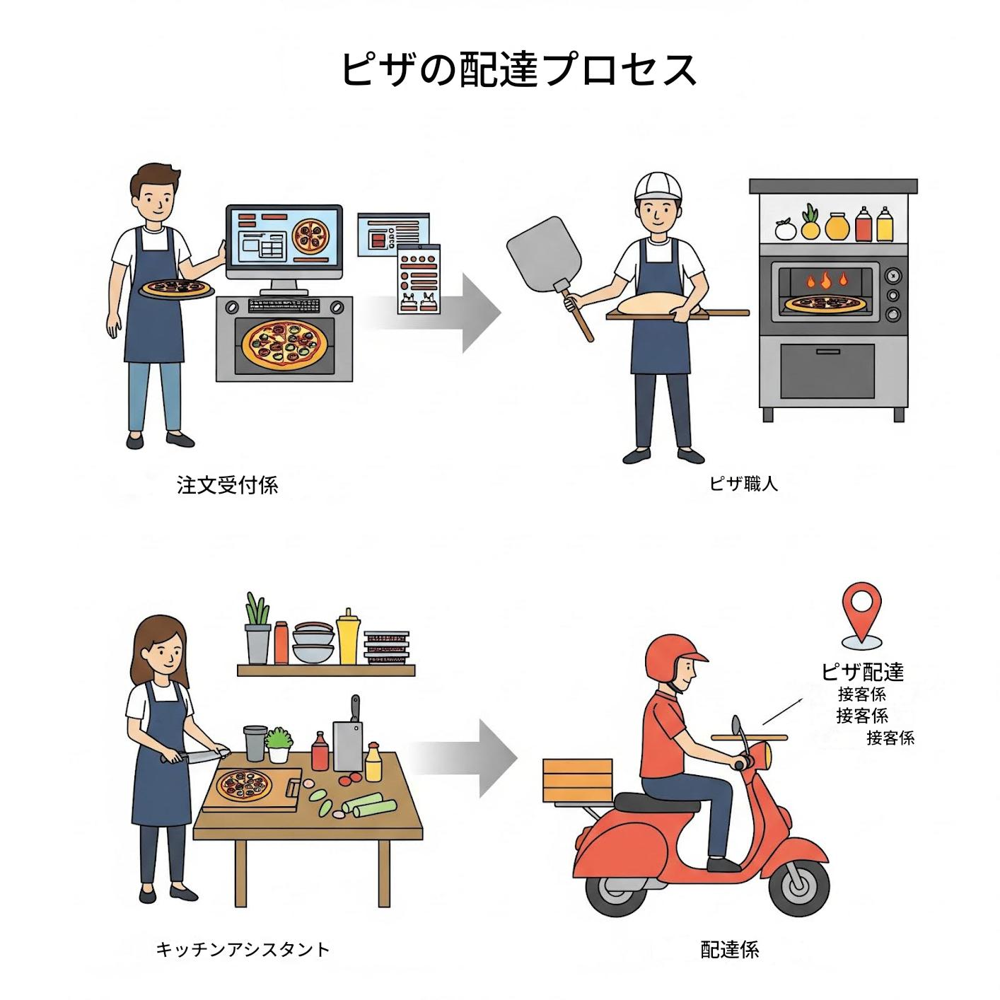
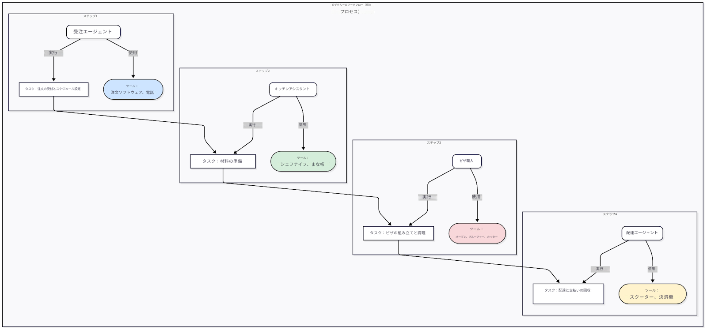
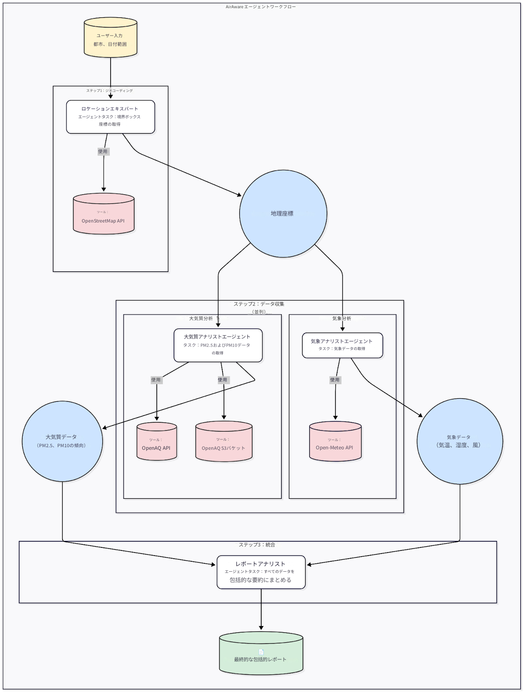
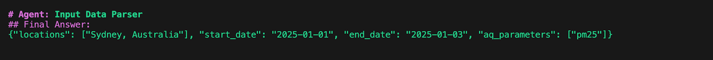
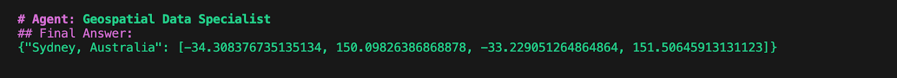
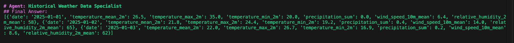
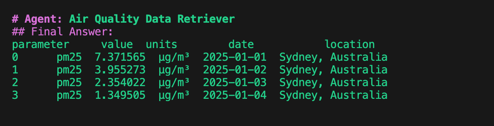
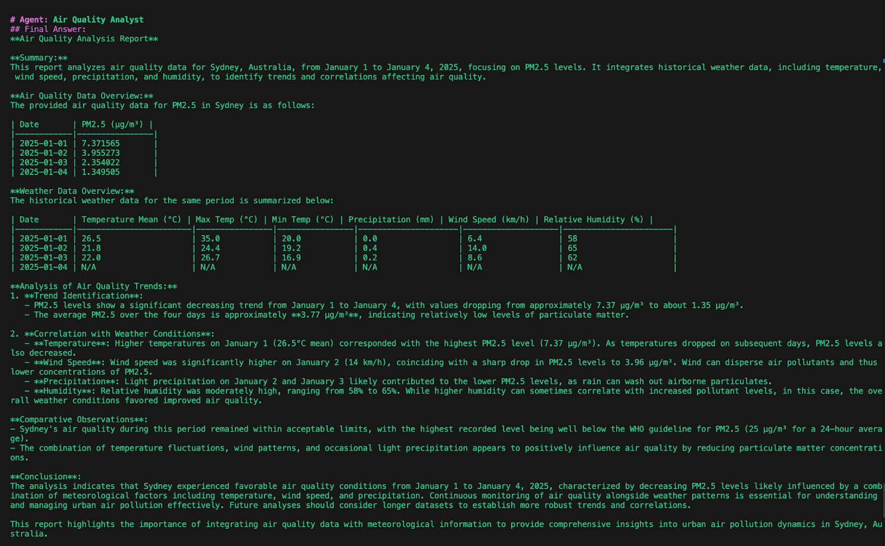

# Lab 2: Designing Multi-Agentic Workflows

Time : 120 Minutes  
Group Size : 2 Members ( Pair Programming)

## Objectives

 # ラボ 2：マルチエージェントワークフローの設計

時間：120分  
グループサイズ：2名（ペアプログラミング）

## 目的

 - [ ] マルチエージェントワークフローの構成要素を設計する
     - [ ] エージェントとタスクの設定方法
     - [ ] エージェントを連結して順次実行されるワークフローを構成する方法
     - [ ] 他の種類のワークフローを探索する

## 1.1 エージェンティック思考の育成

あなたは電話で注文を受けて宅配するグルメピザ店を立ち上げる起業家だと想像してください。**注意：** 店舗への来店は受け付けません、配達専門です。

起業家としてのあなたの仕事は、近隣で成功するピザ店を作るためにクルー（チーム）を組織することです。

やること：

1. 必要なクルーメンバーのタイプを特定する
2. 実行すべき業務を特定する
3. それぞれの業務に必要な備品・機械を特定する
4. 上記の4つ以外に追加のタスクや役割があれば特定して、フローを他のグループに提示する

!!!tip
    ペアでホワイトボードやフリップチャートを使って下表を埋めながら進めてください。

    | クルーメンバー | 実行する業務 | 備品／機械 |
    | ---- | ---- | ---- |
    |  |  |  |
    |  |  |  |

 

## 1.2 このプロセスのためのエージェンティックワークフロー作成

次のパターンのフローをホワイトボードで考えてください：

**Agents** -> _(実行)_ -> **Tasks and Agents** -> _(使用)_ -> **Tools flows**.



**問い：**

あなたのチャートはどうなりますか？チームに発表してください。考えるポイント：

1. 全てのプロセスは順次的（シーケンシャル）ですか？
2. 追加で必要なエージェントはいますか（例：購買をどう扱うか、繁忙期に配達員をどう採用するか、レシピ設計、衛生規制対応は誰が行うか、など）。

## 1.3 ペアプログラミング演習：エージェンティックワークフローの手動コーディング

### ユースケース

大気質（Air Quality）環境調査システムを開発します。

!!! tip
    他の参加者と協力してマルチエージェントワークフローを構築してください。

!!! info "目的"
    あなたは環境データアナリストとして行動します。目的は実世界の環境問題を調査するための大気質調査アプリケーションを構築することです：

    **特定の地点の大気質を解析する（例：花火などの大規模イベントの後に大気質がどう変化したか）、その時の気象条件（気温、風速、気圧など）はどうだったかを調べる。**

### シナリオ
 
 _"ようこそ、アナリストの皆さん。私たちは大気質調査システムの構築を依頼されています。年末年始やお祭りなどの大規模イベントは大気質に大きな影響を与える可能性があります。あなたたちの使命は、環境専門家が継続的に大気質を把握・解析できる信頼性の高いシステムを作ることです."_

### 学生向けワークショップ手順

#### ブリーフィング

* _**目標：**_ ある都市の3日間における大気と気象の質を調査する。

#### アプリケーションのワークフロー

 

#### コード作業

* ワークショップ用テナントの Cloudera AI プロジェクトに移動し、チーム用プロジェクト（`Airaware - Team XX`）を使用します。
* ファイルやフォルダ構成に慣れてください。
!!! note "重要"
    プロジェクト設定で以下の環境変数を作成します。事前条件で生成した OpenAQ API キーを使用してください。<br>
        **Key**: `OPENAQ_API_KEY`   **Value**: `<ENTER_OPENAQ_API_KEY>`<br>

 

!!! note "重要"
    変更を反映させるために、Cloudera AI セッションを作成／再起動してください。

* インストラクタが `main_v1.py` ファイルを開いて構成を説明します。
* 次にマルチエージェントシステムワークフローを設定します。

##### エージェント定義

ここでワークフローのエージェントを定義します。

!!! NOTE
    最初の2行（`input_parser_agent` と `bounding_box_retriever`）の値を `main_v1.py` の指定エリアにコピーしてください。コピー箇所は `LAB` コメントで識別します。最後の3つのエージェントはコードにあらかじめ用意されています。

 | Agent | 役割 | バックストーリー | 目標 | 使用ツール |
 | :---- | :---- | :---- | :---- | :---- |
 | input_parser_agent | 入力データパーサ | 自然言語入力を大気質解析に必要な構造化パラメータへ変換する | ユーザークエリから構造化情報を効率的に抽出する | input_parser_tool |
 | bounding_box_retriever | 地理空間データスペシャリスト | 指定地点のバウンディングボックス座標を取得する | 地理情報取得と空間データ解析の専門家 | bounding_box_extractor_tool |
 | weather_data_integrator | 歴史気象データスペシャリスト | 指定地点と日付について簡潔な歴史気象要約を取得する | 歴史気象解析の専門家 | weather_tool |
 | air_quality_retriever | 大気質データ取得者 | 指定場所・期間の OpenAQ から大気質データを取得する | 大気質データ取得に特化 | air_quality_tool() |
 | air_quality_analyst | 大気質アナリスト | 大気質データと歴史気象データを解析してレポートを生成する | 大気質解析と気象研究の経験者 |  |

##### タスク定義

エージェントが実行するタスクを定義します。タスク領域の最初の2行をコードにコピーしてください。最後の3つのタスクは既に用意されています。

!!! NOTE
    タスク内の変数代入（imputation）に注意してください。例：`user_input` がハードコードされ、タスク間で受け渡されます。

 | Task Name | 説明 | Agent | 期待される出力 |
 | :---- | :---- | :---- | :---- |
 | parse_user_input_task | ユーザ入力 `{self.user_input}` を解析し、locations、start_date、end_date、aq_parameters を InputParserTool で抽出する。 | input_parser_agent | 解析された `locations`、`start_date`、`end_date`、`aq_parameters` を含む辞書 |
 | get_bounding_boxes_task | 各指定地点について `bounding_box_extractor` ツールを使い、バウンディングボックス座標を取得する。各地点に紐づくバウンディングボックスを返す。 | bounding_box_retriever | 各場所の（南、西、北、東）の座標を含む辞書またはリスト |
 | get_weather_data_task | 指定地点ごとにバウンディングボックスと start_date、end_date を使い、指定期間の歴史気象条件の簡潔な要約を weather tool で取得する。大気質に影響しうる主要な気象要素（気温、風、降水など）に着目する。 | weather_data_integrator | 各場所の歴史気象条件の集約を含む辞書またはリスト |
 | get_air_quality_data_task | 各地点のバウンディングボックスを使って start_date から end_date までの OpenAQ データを `air_quality_tool` で取得する。aq_parameters が指定されている場合はそれに集中して取得する。結果を pandas DataFrame として返す。 | air_quality_retriever | 指定場所・日付・パラメータの大気質データを含む pandas DataFrame |
 | analysis_task | 提供された大気質データ（pm10、value、units、date、location など）と同期間の歴史気象情報を用いて解析する。傾向を特定し、必要に応じて平均値を算出し、気象条件が大気質に与える影響について論じる。各地点の要約と結論を含む詳細なレポートを作成する。 | air_quality_analyst | 各地点の大気質解析に関する包括的なレポート（傾向、平均値、気象条件との関係の考察を含む） |

##### ツール定義

ワークフローで使用するツールは以下の通りです（既に設定済みのためレビューしてください）。

 | ツール名 | データアクセス | ツールの機能 |
 | :---- | :---- | :---- |
 | input_parser_tool | ユーザ入力 | 自然言語入力を大気質解析に必要な構造化パラメータへ変換する |
 | bounding_box_extractor_tool | API | 指定地点のバウンディングボックス座標を取得する |
 | weather_tool | API | 指定地点・日付の歴史気象要約を取得する |
 | air_quality_tool | API と S3 バケット | 指定地点・日付の OpenAQ から大気質データを取得する |

##### マルチエージェントワークフローの実行

ターミナルを起動して以下のコマンドでワークフローを実行できます。

```bash
python3 main_v1.py \
--user-input  "Can you provide an air quality report for Melbourne between 01.Jan.2025 to 03.Jan.2025 focussing on pm25 parameter"
```

### 出力の確認

ワークフローの出力を確認し、各タスクの出力を観察してください（最終回答に表示）。

!!! note
    使用する都市や日付によって出力は異なります。

 * **Input Data Parser :**

 

 * **Geospatial Data Specialist**  

 

 * **Historical Weather specialist**  

 

 * **Air Quality Data Retriever**  

 

 * **Airquality Analyst**  

 

 * エージェントが異なるシステムから構造化データ（気象や大気質）を一次キーなしで自動統合している様子を観察してください。
 * 都市を “Singapore” に、日付を `10.07.2025` 〜 `15.07.2025` に変更して試してみてください。
 * これでラボ 2 は完了です。

## 学習メモ

このラボで学んだこと：

 - [x] マルチエージェントワークフローの基本構成要素を学んだ
 - [x] クルーデザインと計画について学んだ
 - [x] imputed_variables を使ってタスク間で値を受け渡す方法を学んだ
 - [x] エージェントが異なるデータソースを協調して統合・合成する方法を学んだ

 **:rocket: これでラボ 2 を終了します :rocket:**

[Lab3へ進む](https://github.com/cloudera-jp/agent-studio-lab-ja/edit/main/content/modules/module1/lab3.md)
