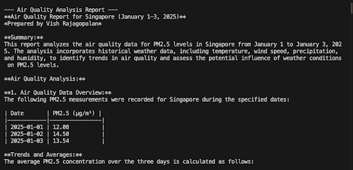
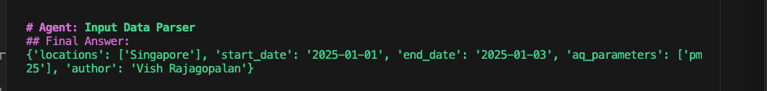

 # ラボ 3（上級）：エージェンティックワークフローでのカスタムツール作成

!!! Question "なぜエージェンティックワークフローでカスタムツールを作るのか？"
    カスタムツールが必要な理由：

    * **LLM は知識のカットオフがある。** 学習時点以降の出来事には対応できない（例：現在の株価など）。
    * **プライベート／専有システムと連携するため。**
    * **信頼性・決定論的な処理を行うため。** LLM は計算等で誤りを起こすことがある。

## 概念的ウォークスルー
カスタムツールは、自然言語をテキストやデータ変換に変換するなど、特定のタスクを実行するエージェント作成に役立ちます。

* インストラクタはプレゼンテーション（[building custom agent tools](https://docs.google.com/presentation/d/1jSKkVN6xjV9blB_2pUYuZwnD1yhOVE9lzcAr-yVV8vE/edit?slide=id.g36b28bd9dbb_0_0#slide=id.g36b28bd9dbb_0_0)）を使ってこのラボを進行します。

## 課題の目的
先のラボで生成した大気質レポートに著者情報がありませんでした。目的はレポートに著者情報を追加することです。カスタムツールの知識を使って、Airquality Investigator System を更新し、レポートに著者情報を付加します。

* アプリケーション入力に以下の情報が追加されます。
### 期待される入力
!!! Input
    Can you provide an air quality report for Sydney  between 01.Jan.2025 to 03.Jan.2025 focussing on pm25 parameter. Please use the name of the author as  Vish Rajagopalan ( USE YOUR TEAM NAME HERE )

### 期待される出力



## 課題タスク

- [ ] ラボの `input_parser` ツールを更新して著者情報を追加する。注：著者情報がない場合はデフォルトで `Cloudera AI Agent Studio` を設定すること。
- [ ] `main_v1.py` を更新して、プロンプトに著者情報が含まれるようにする。

## 解法のヒント

- `input_parser_tool.py` と `main_v1.py` のコピーを作成し、コピーで新しいワークフローを実行して既存作業を失わないようにする。
- `input_parser` クラスを変更して、追加情報が以下のように生成されるようにする（図参照）。

- Pydantic 構造体と `main` 内の `agent_quality_analyst` のプロンプトを変更する。
- 変更は `main_v2.py` と `input_parser_v2.py`（バージョン2コメントを検索）で検証できます。
- 以下のコマンドを実行して出力を比較してください。

```bash
 python3 main_v2.py --user-input  "Can you provide an air quality report for Singapore  between 01.Jan.2025 to 03.Jan.2025 using pm25  parameter.The author of this report should be Vish Rajagopalan"
```

- 変更点をラボ参加者と議論してください。

## 学習メモ

このラボで学んだこと：

- [x] カスタムツール作成の基本を学んだ
- [x] エージェントに新しいツールを装備する方法を学んだ
- [x] ハンドコーディングされたエージェントは、クライアントのワークフローを CAI に移行する際の助言に重要であることを理解した

以上で ラボ 3 は終了です 

おつかれさまでした！


[モジュール2に進む](https://github.com/cloudera-jp/agent-studio-lab-ja/blob/main/content/modules/module2/lab1.md)