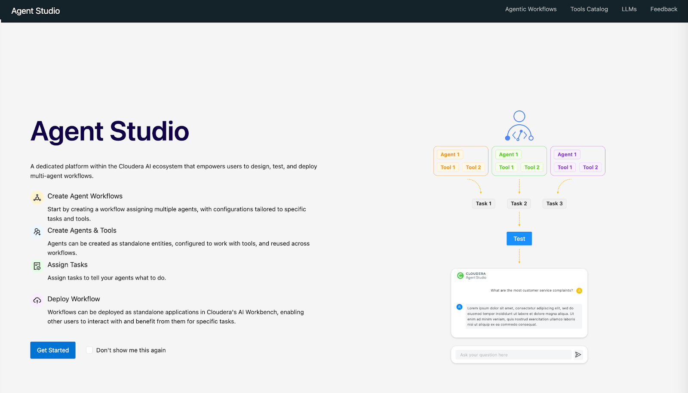
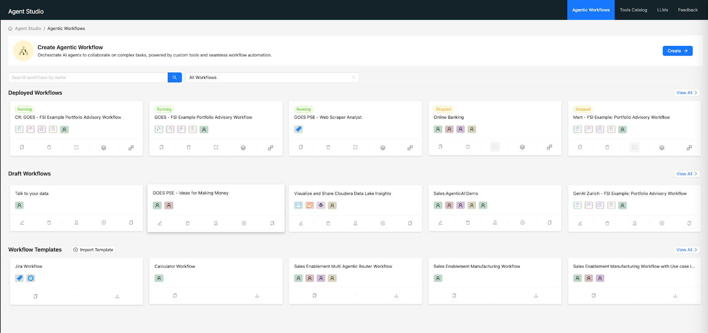
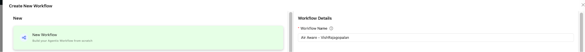
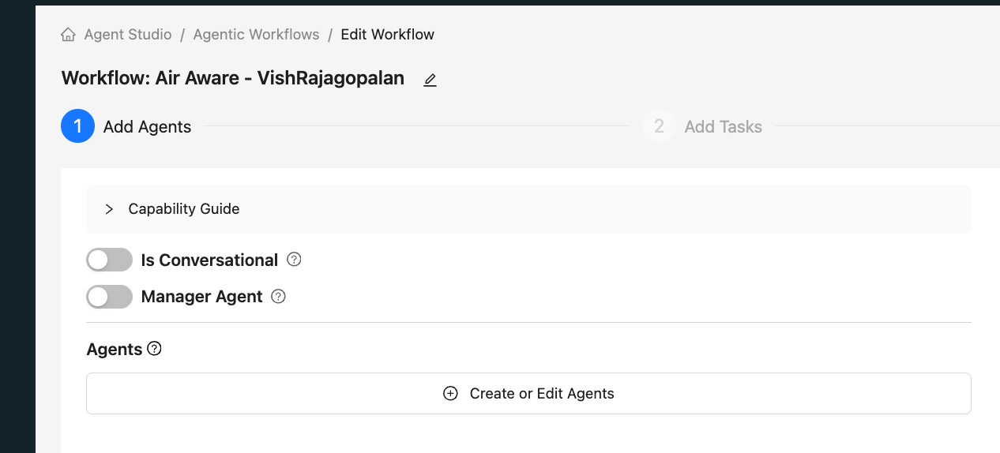
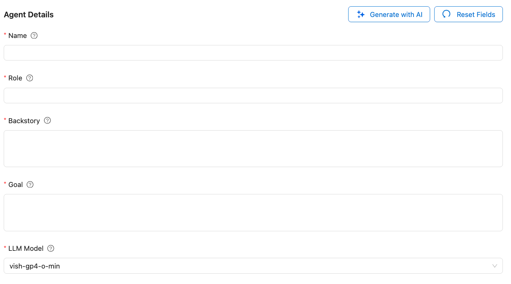
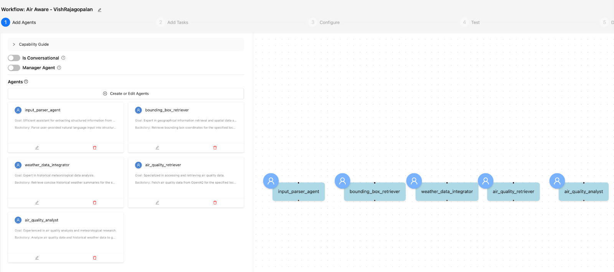

 # ラボ 1: Agent Studio でテンプレートとワークフローを作成

## 目的

このラボでは Agent Studio を使用して、早前に構築した同じ大気質調査システムを作成します。学ぶこと：

- [ ] Agent Studio でワークフローを作成する
- [ ] 5 つのエージェント、タスク、ツールをセットアップする方法を学ぶ

## ラボ手順

!!! warning "重要"
    エージェント作成時に `aistudio-llm-model` をあなたの LLM として使用してください。

* AI Studio メニュー項目の左側から Agent Studio をクリックしてください。下のランディングページが表示されるはずです。

* `Get Started` ボタンをクリックして Agent Studio のホームページに移動します。

* `Create` ボタンをクリックしてワークフローテンプレートウィザードを起動します。

* 新しいテンプレートを作成し、名前を `Air Aware - Team XX` に設定します（チーム名を使用してください）。

* 名前を入力した後、`Create Workflow` をクリックします。

* 次の画面で、「Conversational」と「Manager Agent」が無効になっていることを確認してください。これらの設定の意味については後で説明します。

* このテンプレートを使用してエージェントを作成・編集します。合計 5 つのエージェントを作成します。

**エージェント定義：** 下のセル値を使用して各エージェントを定義します。各エージェントタイプのコードに各セルの値をコピーします。

!!! warning "重要"
    エージェント作成時に `aistudio-llm-model` をあなたの LLM として使用してください。

| Name | Role | Backstory | Goal |
| :---- | :---- | :---- | :---- |
| input_parser_agent | 入力データ変換係 | 自然言語による入力情報をもとに、大気質解析に必要な、構造化されたパラメータへと変換する | ユーザークエリから構造化された情報を効率的に抽出する |
| bounding_box_retriever | 地理空間データの専門家 | 指定した地点のバウンディングボックス座標を取得する | 地理情報の取得と空間データ解析の専門家 |
| weather_data_integrator | 気象履歴データの専門家 | 指定した地点と日付について簡潔な、気象履歴の要約を取得する | 気象履歴解析の専門家 |
| air_quality_retriever | 大気質データ取得係 | 指定した場所と期間に基づき OpenAQ から大気質データを取得する | 大気質データの取得に特化した専門家 |
| air_quality_analyst | 大気質分析官 | 大気質データと気象履歴データを解析し、レポートを作成する | 大気質の解析と気象履歴について豊富な経験を積んだ研究者 |

* この時点ではツールを使用しません。後でツールを追加します。MCP サーバーも使用しません。

* 上記のデータに基づいて 5 つのエージェントを作成します。

* 「Generate with AI」オプションを試して、プロンプトを生成できます。

* その後、下の 5 つのエージェントが表示されるはずです。

## 学習メモ

- [x] Agent Studio でワークフローを作成
- [x] AI Studio の使用を開始し、エージェントを作成する方法を学んだ

**:rocket: これでラボ 1 を終了します :rocket:**
