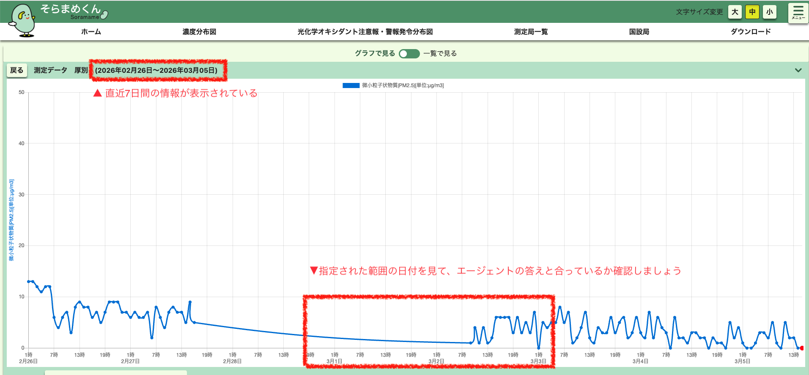

# ラボ 2: Agent Studio でタスクを作成する

## 目的

- [ ] 各エージェント用のタスクを作成する
- [ ] 動的入力（代入）を input_parser 用に作成する

## ラボ手順

### タスクの作成

タスクは、ワークフローをこなす各係に与えられた指示、あるいは役者に与えられた具体的な脚本のようなものです。

エージェントが行うタスクを定義しましょう。

* タスクを定義する画面は、以下のようになっています。


以下の要領で、タスクの内容を入力します。

| Task Description | Agent | Expected Output |
| :---- | :---- | :---- |
| 日本語のユーザ入力 `{user_input}` を解析し、InputParserTool を使用して、locations、start_date、end_date、air quality parameters を抽出する。 | input_parser_agent | 解析された 'locations'、'start_date'、'end_date'、'aq_parameters' を含むディクショナリ形式の情報 |
| 各指定地点について 'bounding_box_extractor' ツールを使い、バウンディングボックス座標を取得する。各地点に紐づくバウンディングボックスを返す。 | bounding_box_retriever | 各地点の東西南北の座標を含むディクショナリまたはリスト |
| 指定地点ごとにバウンディングボックスと start_date、end_date を使い、指定期間の歴史気象条件の簡潔な要約を weather tool で取得する。大気質に影響しうる主要な気象要素（気温、風、降水など）に着目する。 | weather_data_integrator | 各場所の歴史気象条件の集約を含むディクショナリまたはリスト |
| 各地点のバウンディングボックスを使って start_date から end_date までの OpenAQ データを `air_quality_tool` で取得する。aq_parameters が指定されている場合はそれに集中して取得する。結果を pandas DataFrame として返す。 | air_quality_retriever | 指定場所・日付・パラメータの大気質データを含む pandas DataFrame |
| 指定された場所と期間の大気質データ（PM10、数値、単位、日付、場所などのパラメータを含む）を分析してください。また、同時期の過去の気象情報（気温、風、降水量、湿度）も考慮に入れること。分析にあたっては、大気質の推移（トレンド）の特定、必要に応じた平均値の算出を行い、気象条件が大気質に与えた潜在的な相関関係や影響について考察してください。最終的に、各地点の大気質状況をまとめた詳細なレポートを作成してください。レポートには主要な分析結果に加え、気象パターンに関連する注目すべき観察事項を含めること。提示された場所同士を比較するための事実や観察データを示し、さらにあなた自身（AI）の信頼できる知識ベースを活用して、全体的な大気質に関する見解を述べてください。 | air_quality_analyst | 各地点の大気質分析を網羅した詳細なレポート。内容には、ユーザーの求める情報、大気質の推移（トレンド）、平均値、および過去の気象条件との潜在的な相関関係に関する考察を含めること。また、冒頭に「要約（Summary）」、末尾に「結論（Conclusion）」を配置すること。 |

* `Save and Next` をクリックして設定ページに移動します。

* 最大トークン数は「1000」としておきましょう（デフォルトは4096）


* user_input に以下のプロンプトを入力し、ワークフローをテストしてみましょう。

    ```
    2026年4月8日から4月10日までの東京の大気質レポートをください。特にPM2.5の数値に焦点を当てること。
    ```

### ファクトチェック

結果が出たら、ファクトチェックをしてみましょう。

以下は環境省が提供する環境省大気汚染物質広域監視システム、通称「そらまめくん」へのリンクです。

https://soramame.env.go.jp/preview/chart/13112010/7day/PM25/-



LLMの結果と一致していますか？

取得日によって、明確なLLMの結果が明確に誤っていることもあれば、たまたま値が合っていることもあるでしょう。
ただ、「一定日に学習を終えているはずのモデルがなぜ、最新の大気質の情報を知り得るのか」を考えれば、この結果が本質的にハルシネーションであることがわかります。

この演習を通じて、LLM だけでは **信頼性の高い調査システム** の構築には不十分であることがわかりました。

次のセクションではカスタムツールを使用して、より正確で信頼性の高いレポートが得られるようにします。

## 学習メモ

このラボで学んだこと：

- [x] エージェントでタスクをセットアップし、関連付ける方法を学びました

- [x] プロンプトのみでは高品質な出力を生成する能力が不足していることを認識しました

以上でラボ2は終了です。

[ラボ3へ進む](./lab3.md)

[トップに戻る](./README.md)
