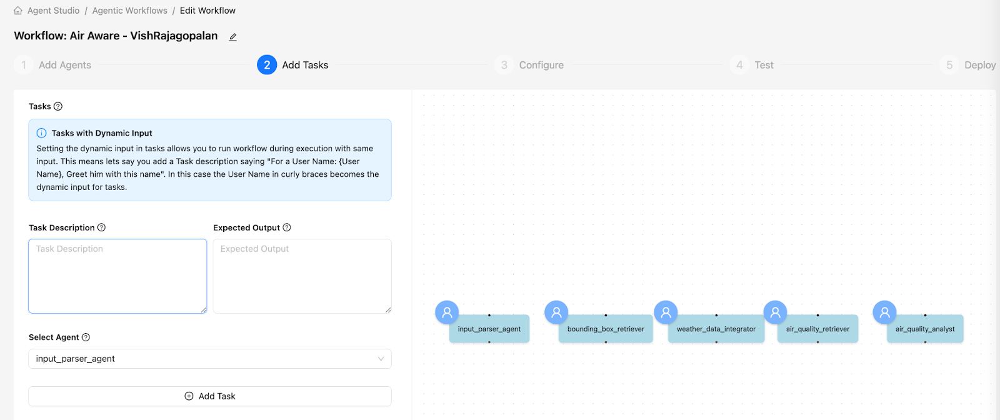
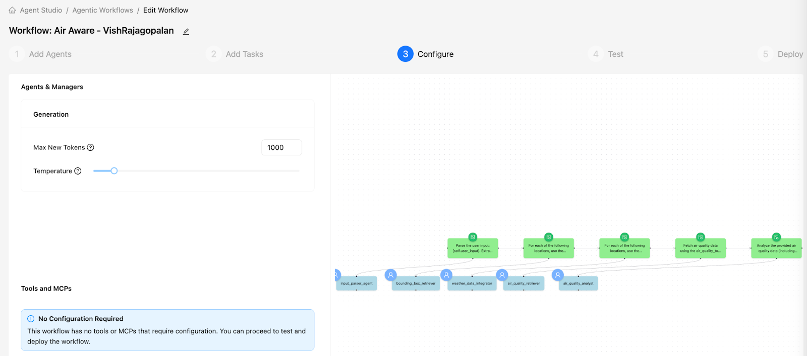
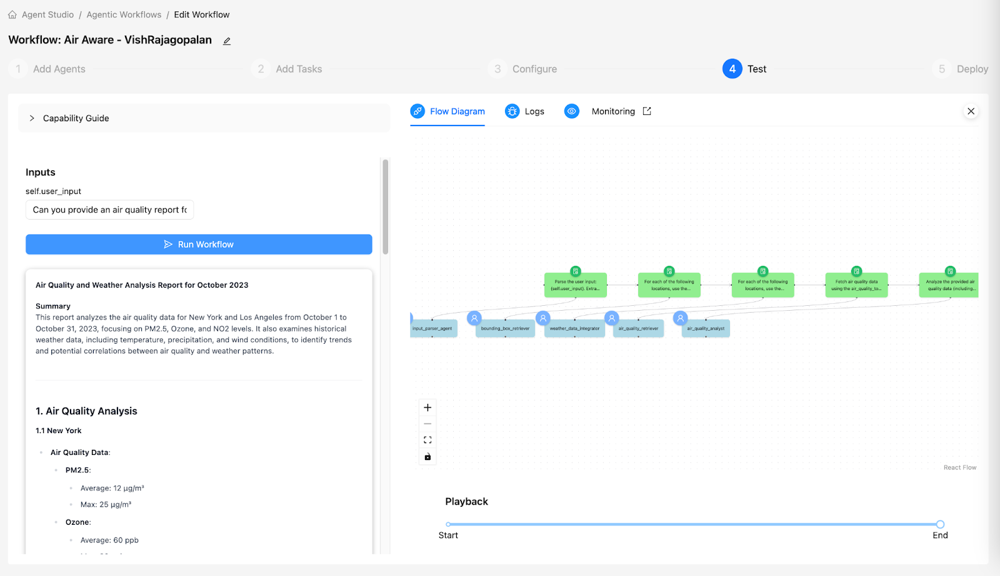

````markdown
# ラボ 2: Agent Studio でタスクを作成

## 目的

- [ ] 各エージェント用のタスクを作成する
- [ ] 動的入力（代入）を input_parser 用に作成する

## ラボ手順

エージェントが働くべきタスクを定義しましょう。

* 下に示すタスク画面から始めます。



| 説明 | Agent | 期待される出力 |
| :---- | :---- | :---- |
| ユーザ入力 `{user_input}` を解析し、locations、start_date、end_date、air quality parameters を InputParserTool で抽出する。 | input_parser_agent | 解析された 'locations'、'start_date'、'end_date'、'aq_parameters' を含む辞書 |
| 各指定地点について 'bounding_box_extractor' ツールを使い、バウンディングボックス座標を取得する。各地点に紐づくバウンディングボックスを返す。 | bounding_box_retriever | 各場所の（南、西、北、東）の座標を含む辞書またはリスト |
| 指定地点ごとにバウンディングボックスと start_date、end_date を使い、指定期間の歴史気象条件の簡潔な要約を weather tool で取得する。大気質に影響しうる主要な気象要素（気温、風、降水など）に着目する。 | weather_data_integrator | 各場所の歴史気象条件の集約を含む辞書またはリスト |
| 各地点のバウンディングボックスを使って start_date から end_date までの OpenAQ データを `air_quality_tool` で取得する。aq_parameters が指定されている場合はそれに集中して取得する。結果を pandas DataFrame として返す。 | air_quality_retriever | 指定場所・日付・パラメータの大気質データを含む pandas DataFrame |

* `Save and Next` をクリックして設定ページに移動します。

* 下のように構成を `1000` 新規トークン に設定します。



* では、ワークフローをテストしてみましょう。以下の user_input を使用します。

    ```
    Can you provide an air quality report for Sydney, Australia  between 01.May.2025 to 03.May.2025 focussing on pm25 parameter
    ```

* ご覧のように、LLM は現在幻覚を起こしており、2023 年 10 月のニューヨークとロサンゼルスなどのデータを生成しています。



!!! info
    エージェントとタスクをセットアップしましたが、デフォルト LLM は**信頼性の高い調査システム**を構築する能力に欠けています。

    次のセクションではカスタムツールを使用して、より正確で信頼性の高いレポートが得られるようにします。

## 学習メモ

このラボで学んだこと：

- [x] エージェントでタスクをセットアップし、関連付ける方法を学んだ

- [x] プロンプトのみでは高品質な出力を生成する能力が不足していることを認識した

**:rocket: これでラボ 2 を終了します :rocket:**

````
