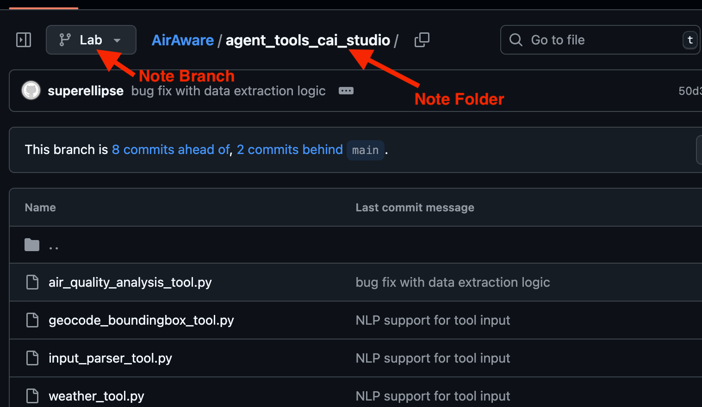

````markdown
# ラボ 3: Agent Studio でカスタムツールを作成

## 目的

- [ ] このラボでは、エージェントワークフローを API と S3 バケットに接続します。

- [ ] Toolカタログでのツール作成とワークフローでの使用方法を学びます。

## ラボ手順

* Tool Catalog でツール作成を始めましょう。


* 以下の名前でツールのリストを作成します：
  * Input Parser  `TeamXX` （チーム名を使用）

!!! NOTE
    ツール名には特殊文字は使用できません。


* Tool ファイル編集を表示をクリックします。


!!! Danger "重要"
    ブランチ名：「LAB」ブランチと フォルダ名：すべてのツールに対して「agent_tools_cai_studio」を使用します。

* ツールコードを更新します：
    * GitHub の CAI カスタムツール用ロケーションにアクセスします [url](https://github.com/SuperEllipse/AirAware/tree/Lab/agent_tools_cai_studio)
    * input_parser_tool.py コードを tool.py ファイルにコピーします
    * Cloudera AI `tool.py` ファイルの`input_parser_tool.py` コードを更新します。

!!! Danger "重要"
    使用するフォルダが `agent_tools_cai_studio` であることを確認してください。
    


* リフレッシュして `input_parser_tool.py` が更新されたことを確認します。最後に下のボタンをクリックしてツールを保存します。


* 同じアプローチを使用して、tool.py を更新して 3 つ以上のツールを同様に作成します。チーム名を追加するのを忘れないでください。
    * Geocode_Boundingbox Tool
    * Weather Tool
    * Air Quality Analysis Tool（**注意**：ここでは 2 つのファイル tool.py と requirements.txt を更新する必要があります。以下の注意を参照してください）

!!! danger "重要"
    Air Quality Analysis Tool には追加パッケージが必要なため、requirements.txt を以下のパッケージで更新してください。
    ```
    #UPDATE THE requirements.txt with the below
    # https://pip.pypa.io/en/stable/reference/requirements-file-format/
    pydantic
    boto3==1.38.17
    pandas==2.2.3
    ```

* Tool Catalog で作成したツールがリストされていることを確認します。

* では、ワークフローに戻り、「Edit Workflow」をクリックします。


* ワークフロー内で「Create or edit agents」をクリックします。


* Input_parser_agent を選択し、`Add optional tools` セクション `Create or Edit Tools` をクリックします。


* Tool Catalog からあなたのツール名を見つけます。


* 「Create Tool from Template」ボタンをクリックしてツールを追加します。

    * `Save Tool` ボタンを使用してツールを保存できるようになります。

    * _Optional Tools_ セクションに追加されたツールが表示されるようになります。

    * 最後に `Save Agent` ボタンを使用してエージェントを保存できます。

* ワークフロー内でエージェントに関連付けられたツールがどのように見えるかに注目してください。


* 同じアプローチに従って、他のすべてのツールをエージェントワークフローに追加します。すなわち：
    * Geocoding Tool
    * Weather Tool
    * Air Quality Analysis Tool

* 最後に、ワークフローは以下のようになるはずです。


## 学習メモ

- [x] このラボでは、Agent Studio でカスタムツールを作成し、エージェントにこれらのツールを装備する方法を学びました。

**:rocket: これでラボ 3 を終了します :rocket: **

````
