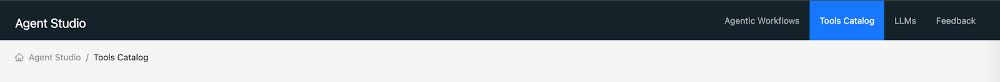
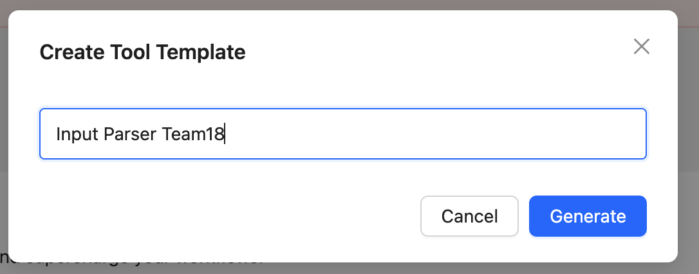
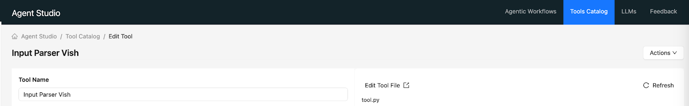
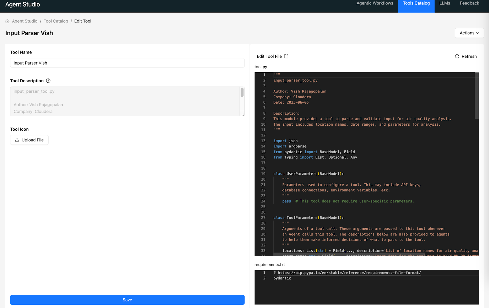
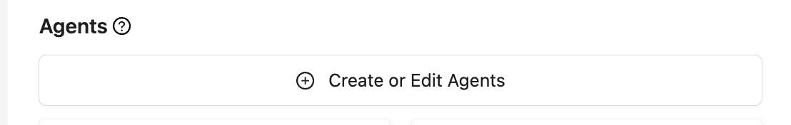
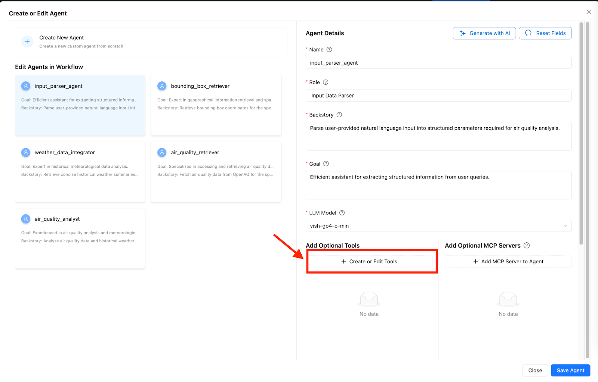
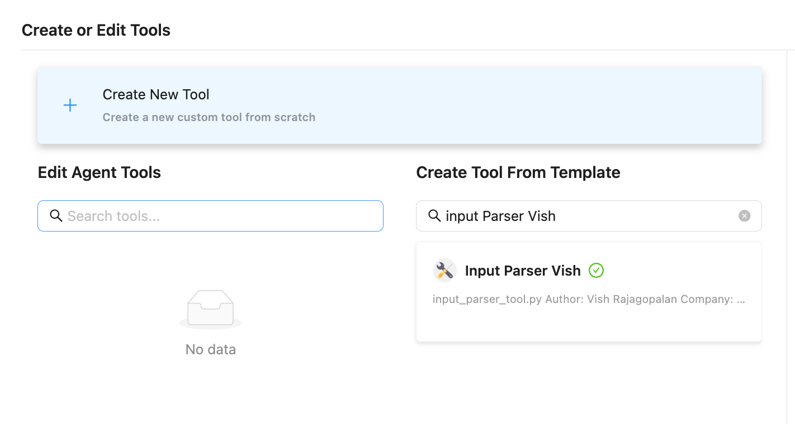
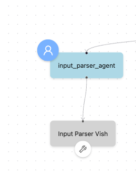
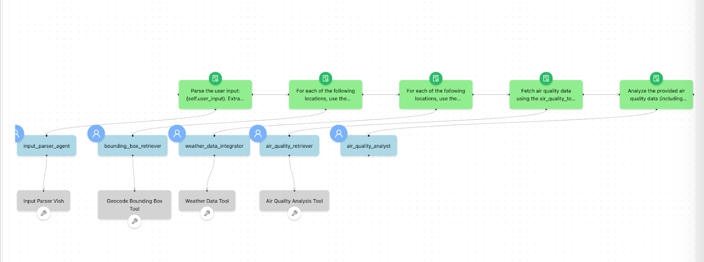

# ラボ 3: Agent Studio でカスタムツールを作成

## 目的

- [ ] このラボでは、エージェントワークフローを API に接続します。

- [ ] Toolカタログでのツール作成とワークフローでの使用方法を学びます。

## 解説

### ツールとは

エージェントにツールを持たせることで、以下のような「実行機能」を持たせることができます。

- 特定のAPIを実行する
- 特定のデータベースを実行する
- 特定の計算処理を実行する

ツールを活用することで、信頼できる情報ソースからAPI経由で情報を取得したり、出力結果をメールやチャットなどで送信したり、設計によってはWebサイトを直接更新するといったことも可能になります。

### Agent Studio におけるツール

ツールは python の関数の形で実装されます。

コード例：

https://github.com/cloudera-jp/AirAware_JA/tree/main/agent_tools_cai_studio

エージェントにツールを使わせるにあたり、明確な関数の call 処理を実装する必要はありません。

ただ、プロンプトやコンテキストにおいて、以下を明確にしておくことが重要です。

- どのツールを使うべきかの指示を明確に行う
- ツールが必要とする引数に該当する情報を与えておく

ツールとなる関数の実装にあたっては、以下に留意しておくとよいでしょう

- 引数は args など、call エラーが起こりにくい形で定義しておく
- 引数が足りない場合は、関数の中でどの引数が足りないかがわかるエラーを返す
- 上記のエラーに基づき、もし先行するエージェントが該当する引数の情報を渡していない場合は、エージェントが自律的に連携して処理をやり直し、引数を渡し直すことができる

## ラボ手順

* Tool Catalog タブをクリックします。

* ツール名は以下のように設定してください：
  * Input Parser XX （XXにはユーザーIDの数字を設定）

ツール名にはスペースを含めることはできますが、特殊文字（-や_など）は**使用できません。**

* 「Edit Tool File」ボタンをクリックします。

`tools.py` の内容を更新します。

tools.pyの現在のコードを削除し、下記リンクの「input_parser_tool.py」のコードをコピーしてください。

https://github.com/cloudera-jp/AirAware_JA/tree/main/agent_tools_cai_studio

* もとの画面に戻り、リフレッシュボタンをクリックすると、 `tool.py` の内容が更新されたことが確認できます。最後に「Save」ボタンをクリックしてツールを保存します。

* 同じ要領で、以下のツールも作成します。

|ツール名|tool.py の更新内容| requirement.txtの更新 |
|:-|:-|:-|
|Geocode XX|[geocode_boundingbox_tool.py](https://github.com/cloudera-jp/AirAware_JA/blob/main/agent_tools_cai_studio/geocode_boundingbox_tool.py)|不要|
|Weather XX|[weather_tool.py](https://github.com/cloudera-jp/AirAware_JA/blob/main/agent_tools_cai_studio/weather_tool.py)|不要|
|Air Quality XX|[air_quality_analysis_tool.py](https://github.com/cloudera-jp/AirAware_JA/blob/main/agent_tools_cai_studio/air_quality_analysis_tool.py)|以下の内容で上書きする pydantic boto3==1.38.17 pandas==2.2.3|

※ ツール名のXXにはユーザーIDの数字を設定してください

* Tool Catalog の画面で、作成したツールが表示されていることを確認します。

* ワークフローに戻り、「Edit Workflow」をクリックします。

* ワークフロー内で「Create or edit agents」をクリックします。

* Input_parser_agent を選択し、`Add optional tools` セクションの `Create or Edit Tools` をクリックします。

* Tool Catalog から、先ほど作成したツールを見つけます。

* 「Create Tool from Template」ボタンをクリックしてツールを追加します。

    * `Save Tool` ボタンを使用してツールを保存できるようになります。

    * _Optional Tools_ セクションに追加されたツールが表示されるようになります。
 
    * エージェントの description の最後に、`output の都市名は英語表記とすること。` と追加しておくとよいです。

    * 最後に `Save Agent` ボタンを使用してエージェントを保存します。

* ワークフロー内でエージェントに関連付けられたツールがどのように見えるかに注目してください。

* 同様に、以下のエージェントにもツールを追加します。

|エージェント名|追加するツール |
|:-|:-|
|bounding_box_retriever|Geocode XX|
|weather_data_integrator|Weather XX|
|air_quality_retriever|Air Quality XX|

最後の `air_quality_analyst` エージェントには、ツールの設定は不要です。

先行するエージェントがツールを使っているのは、最終的に `air_quality_retriever` が [OpenAQ](https://openaq.org/) のAPIを正しい形式で呼べるように、出力データの形式を調整するためです。

最後の `air_quality_analyst` エージェントは、`air_quality_retriever` が取得した [OpenAQ](https://openaq.org/) の情報をもとに自然言語でレポートを生成する役割を担いますが、これは Agent Studio のデフォルトの機能とLLMの能力で足りるため、 `air_quality_analyst` エージェントにはツールが不要というわけです。

* 以下のように、先行する4つのエージェントにツールが紐づいていればOKです。

## 学習メモ

- [x] このラボでは、Agent Studio でカスタムツールを作成し、エージェントにこれらのツールを装備する方法を学びました。

以上でラボ3は終了です。

[ラボ4へ進む](./lab4.md)

[トップに戻る](./README.md)
