markdown

# ラボ 4: ワークフローの テスト、監視、デプロイ

## 目的

- [ ] このラボでは、エージェンティックワークフローをテスト、監視し、アプリケーションとしてデプロイします。

## ラボ手順

* ホームページから編集モードでワークフローをクリックします。

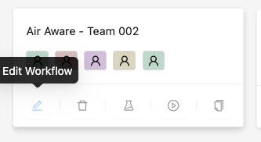

* 能力説明をクリックして、下のテキストボックスに以下のテキストを追加します。

```text {.prompt-block}
「Air Aware」ワークフローは、指定された場所と日付範囲に対して包括的な大気質分析を提供するように設計されています。これには、このゴールを達成するために協調的に動作する一連の専門家エージェントとタスクが含まれます。このプロセスは各場所のバウンディングボックス座標の取得から始まり、その後、これらの座標を使用して、温度、風、降水などの大気質に影響する要因に焦点を当てた歴史的気象データを収集します。同時に、OpenAQ から指定されたパラメータに焦点を当てた大気質データが取得されます。収集されたデータは、傾向を特定し、平均値を計算し、気象条件と大気質の間の潜在的な相関関係を探るために分析されます。ワークフローは、各場所の大気質状況を要約し、重要な発見と気象パターンに関連する注目すべき観察をハイライトする詳細なレポートで締めくくられます。

ツールへの入力 : 
Can you provide an air quality report for Sydney  between 01.Jan.2025 to 03.Jan.2025 focussing on pm25 parameter
```

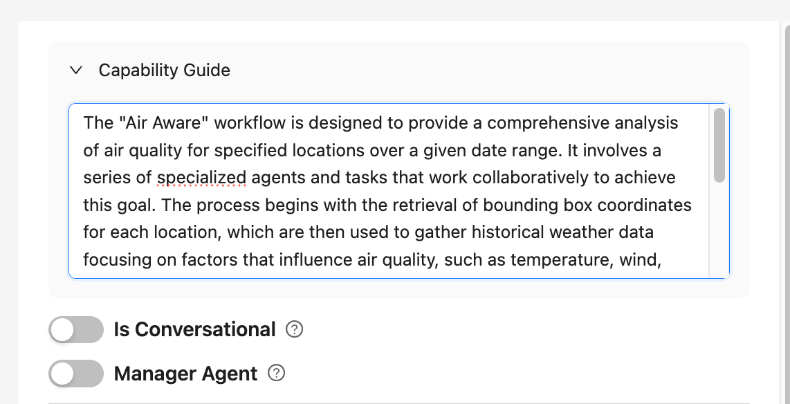

* `Save & Next` をクリックしてワークフローの _Configure_ ステップに到達するまでクリックします。

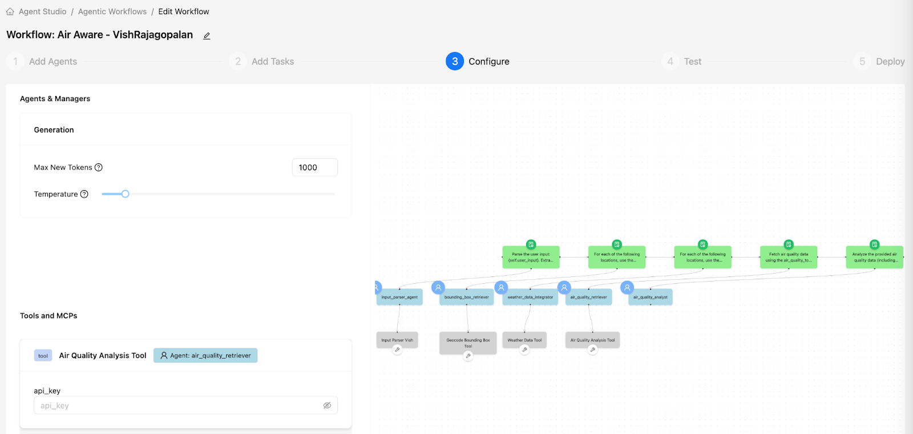

* 「Getting Setup for Workshop」ラボで作成した Open AQ ウェブサイトから生成した API キーを入力します。`Save & Next` をクリックします。


ラボ 1 リファレンス：[Getting Setup for Workshop](../module1/lab1.md)

* 以下のテキストを `user_input` テキストボックスに追加してワークフローをテストします。

```text {.prompt-block}
2026年3月1日から3月3日までの東京の大気質レポートをください。特にPM2.5の数値に焦点を当てること。
```

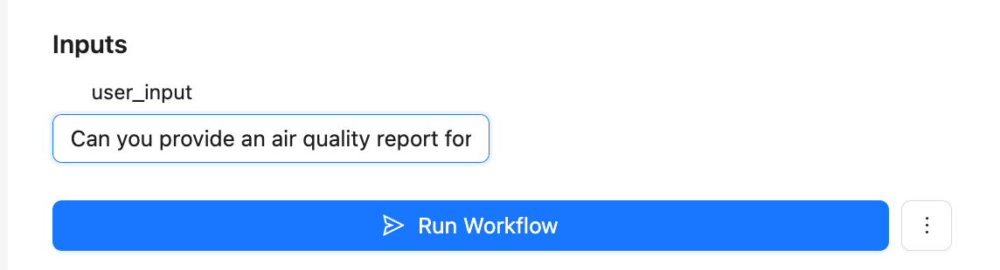

* 「Monitoring」アイコンタブをクリックして Phoenix を使用してワークフローを監視します。

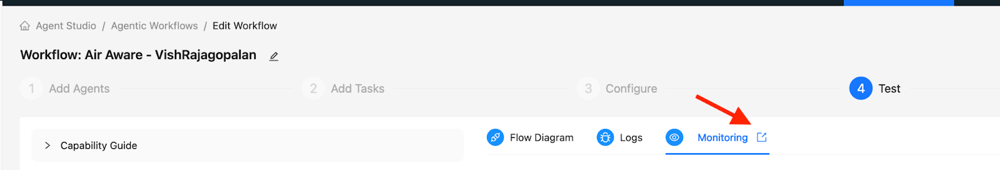

* プロジェクト名をクリックして Phoenix を使用してワークフロー監視できるようになります。

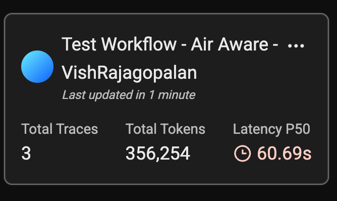

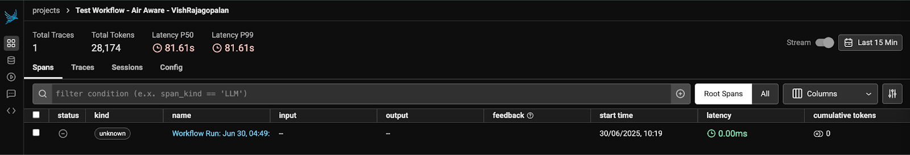

* 各ツール用のワークフローを確認します。例えば、以下は Input Parser Agent のワークフローを示しており、ツールを使用してユーザ入力を解析しています。

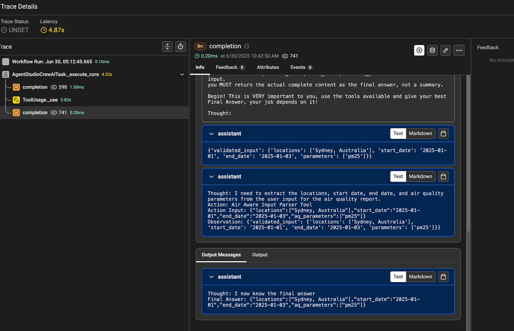

* もしワークフローが正常に実行された場合、最終大気質レポートが表示されます。

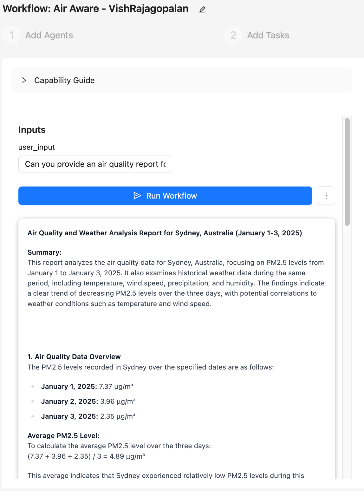

* `Save & Next` をクリックして、最初にワークフローをテンプレートとして保存してから `Deploy` します。

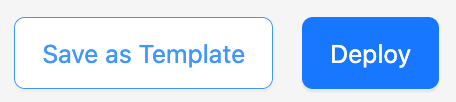

!!! note 
    アプリケーションのデプロイには 5～10 分かかることがあります。

* ワークフローを再度開き、`Actions` メニュー項目をクリックしてデプロイする必要がある場合があります。

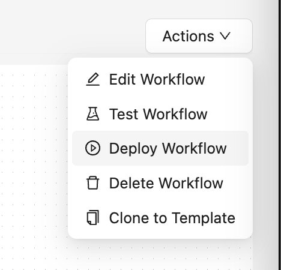

* デプロイが成功すると、メインの Deployed Workflows セクションにワークフローが表示されるようになります。

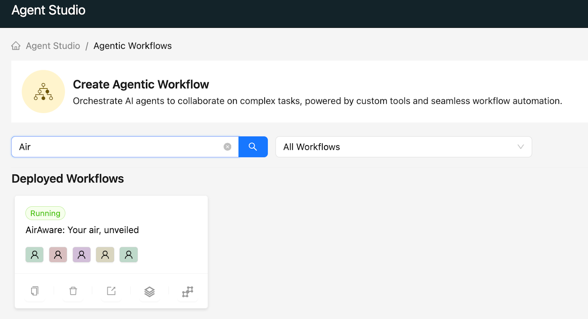

* では、デプロイされたワークフローを通常のユーザのように実行してみましょう。下に示すようにアプリケーションリンクをクリックします。

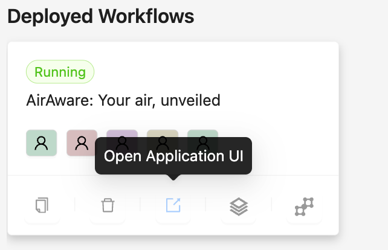

* これにより UI ページが開きます。以下の入力を入力して、3 つの都市の大気質を比較してテストしてみましょう。

```text {.prompt-block}
Can you provide an air quality report for Melbourne between 01.Jan.2025 to 03.Jan.2025 focussing on pm25 parameter
```

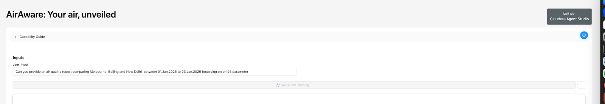

* 数分後、完全な大気質レポートが表示されるようになります（スクリーンショットでは一部表示）。

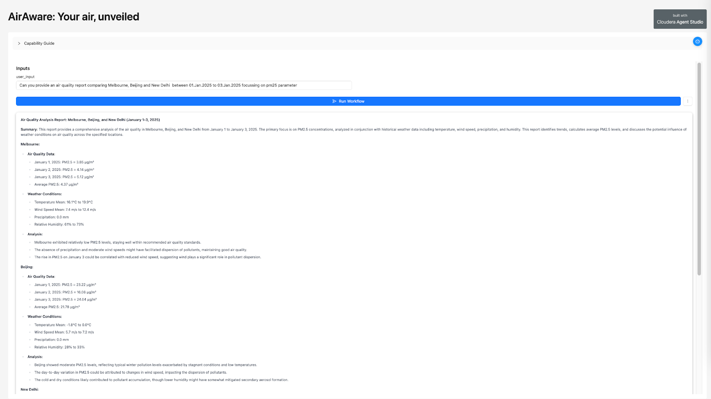

* スクロール ダウンしてレポート全体をノートパソコンにダウンロードします。

## 学習メモ

- [x] このラボでは、エージェンティックワークフローをテスト、監視し、アプリケーションとしてデプロイする方法を学びました。

これでラボ 4 を終了します。

以上でハンズオンのすべての演習は終了です。おつかれさまでした！

